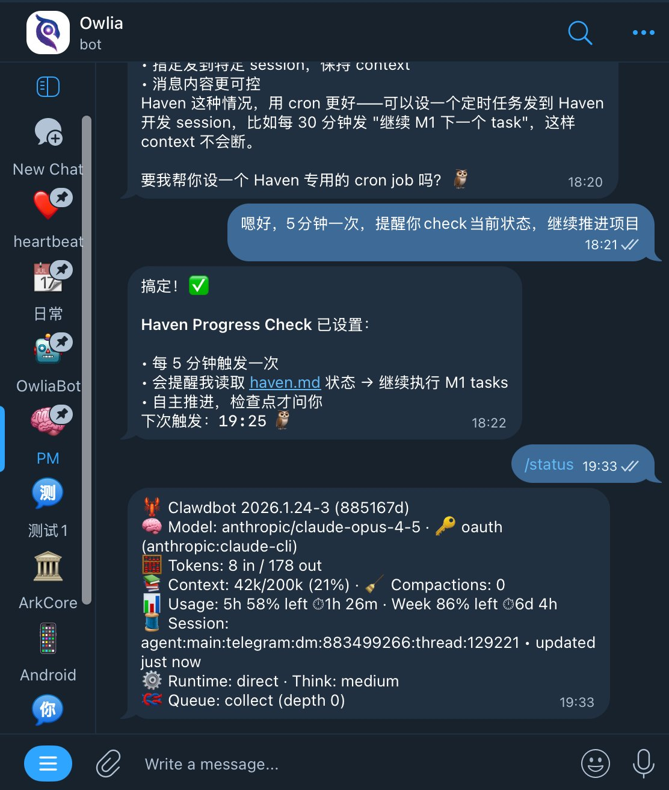

The promised second tutorial is here. In just a few days since my last update, Moltbot has renamed itself again—the pace of the AI era is truly relentless. Even faster than the name changes is the wave sparked by moltbook, with all kinds of agent-oriented products emerging left and right, opening my mind to the early shape of a new era. But let's not get into that today; let me first fill in the gaps from before and share my experience and insights on using OpenClaw through Telegram and Discord.

## Channel Selection: WhatsApp, Telegram, or Discord?

OpenClaw currently supports mainstream channels including WhatsApp, Telegram, Discord, iMessage, Slack, and more. I've personally used WhatsApp, Telegram, and Discord.

First, unless absolutely necessary, I'd suggest ruling out WhatsApp—it has higher costs and risks. This is because OpenClaw's login method isn't officially sanctioned; it essentially treats OpenClaw as a web client scanning a QR code to log in, which is a bit hacky. This leads to unstable connections with frequent disconnections. Additionally, you'd probably need a separate phone number to register, since you can't use your current WhatsApp account—otherwise, what would you use to interact with it? 😂 So unless you're particularly dependent on it, I'd recommend skipping this channel.

That leaves Telegram and Discord. Their vibes are quite different: Telegram leans toward point-to-point DM chat; Discord centers around Servers containing numerous channels with high flexibility, which gives OpenClaw more room to work. In my setup, Telegram mainly handles "quick and direct" conversations, while Discord is for complex, systematic tasks and work that can be parallelized.

## Understanding Main Session: How Your AI Assistant Identifies Its Owner

Before explaining my setup, I need to introduce OpenClaw's Main Session concept.

Main Session is the session where OpenClaw believes it's directly conversing with its Owner. For example, DMs with a Telegram, WhatsApp, or Discord Bot, as well as iMessage—these one-on-one scenarios with the Bot are considered direct Owner conversations. One benefit is that the main memory file MEMORY.md can be loaded by default, since it contains context with privacy implications. Other sessions won't load it—you wouldn't want someone in a group chat to casually extract your favorite anime genres, right? 😄

Another benefit is that these Sessions are connected by default. If you say 1, 2, 3 separately in iMessage, Discord, and Telegram, from the Agent's perspective it's all part of one conversation—no difference.

But this creates a potential issue: if you share your Bot with family or friends (say, by opening Telegram access), the Agent can't distinguish whether messages are from you or your family, treating them all as one context—which gets messy.

A configuration solves this: session.dmScope. Set its value to "per-channel-peer" to isolate different Channels and different users within the same Channel. This way, whether it's between your own Discord and Telegram, or between you and your family's Telegram, they all become independent Sessions without interference.

```json
...,
"session": {
    "dmScope": "per-channel-peer"
},
...
```

You might wonder: can I separate from family while keeping my own DMs interconnected? Yes, you can. There's another config called session.identityLinks where you can link your different DM Sessions into one, achieving "external separation, internal connectivity."

```json
session: {
    scope: "per-sender",
    dmScope: "main",
    identityLinks: {
      alice: ["telegram:123456789", "discord:987654321012345678"],
    },
   ...
}
```

You don't need to manually edit config files for these settings—that risks breaking things. It's better to just instruct your OpenClaw Bot directly to configure them.

For more related configurations, check out [this section](https://docs.openclaw.ai/gateway/security#dm-session-isolation-multi-user-mode) of the official documentation.

## Discord's Information Hierarchy: The Magic of Threads 💬

Discord has another excellent information hierarchy capability, which I believe was borrowed from Slack: Threads. You can create a Thread on any message to continue discussing the topic beneath it. For example, a Channel called "What to eat for lunch" where everyone discusses daily meal choices. If Xiao Shuai says "I want fish," replies pile up below—some continue the fish topic like "grilled or stewed?", while others start new topics like "I want beef." This is basically WeChat group reality (though the Quote feature helped somewhat); communication works but easily becomes chaotic.

With Thread mode? If you want to continue discussing fish, create a Thread under Xiao Shuai's message. This opens a new chat space where everyone can follow the "what kind of fish" topic. Meanwhile, outside the Thread, the main thread remains for proposing lunch options, like the beef people who might already be booking a restaurant in their thread. It's clearly a better communication architecture—clear topics, controllable details.


With Thread mode explained, the full architecture becomes clear: each Channel in a Discord Server is an independent Session, which makes sense; beyond Channels, each Thread is actually the same as a Channel—an independent Session. The latest version (2026.2.1) added a feature: "Discord: inherit thread parent bindings for routing." Simply put, when a Thread is created, the agent automatically inherits recent messages from the parent channel as context, giving the agent "previous chapter" knowledge in the thread. Use Threads well and your Discord information organization will improve dramatically, and session explosion won't be an issue.

## My Discord Workflow: The Bunker in Action

Let me show you my Discord usage. I created a dedicated Server—if you've read my previous articles, you might know I have an AI workflow Server called "[The Bunker](https://x.com/zhixianio/status/2012092307613622525)." I've now created a special Section to host my entire workflow with Owlia 🦉 (my OpenClaw agent).


Check out the screenshot—I basically divide things into three categories:

One called "daily" for brainstorming phase chats, where you can see a long list of open Threads below; another type is content that has graduated into independent projects like owliabot and writing; and there's also daily pushes like digest and heartbeat.

In daily chat channels, I give the Agent an instruction: whenever I post something there, your reply must first create a Thread, then continue in that Thread. Currently this is a soft constraint, but it works great—it follows it almost every time.

The benefit is that Daily channel stuff is miscellaneous. When you suddenly remember something to discuss further—like "I want to buy the BTC dip, how should I do it"—after posting, the Agent analyzes the situation, asks about your preferences and current position, and you can keep chatting.

When something grows large enough that you feel it could become a long-term project, even one the Agent could proactively push forward, make it an independent Channel. You can tell the Agent in the new channel that this continues a previous Thread, have it Compress the original Session here, and the conversation picks up. Progress becomes easier because in this channel, you can still use Threads for multi-dimensional discussion and folding.

The benefit of this workflow is super-fast switching between different matters. OpenClaw can reply to 4 different Sessions simultaneously by default, and this quota is configurable, but 4 is enough for me—I rarely have 4 channels actively replying at once (still practicing). You'll feel like "Doctor Octopus," wielding four big arms operating four work threads, which feels incredibly satisfying.

Besides task-pushing Channels, you can create daily scheduled task Channels. This splits work that was previously in the main session across different directions. For example, I have a dedicated Channel called digest that runs several times daily, aggregating X and blog content there. Another example is heartbeat—I need an observation window to see trigger times and content, so I created a heartbeat Channel directing all output there. Configure based on your daily work and life needs.


Once configured, the entire "Bunker" becomes incredibly powerful. Not only does it have automated processes, but a powerful intelligent agent lives inside who can help you work, research, and chat. These sessions are isolated, yet you can specify one session to read another session's content for quick context sync. This experience fits complex work needs perfectly.

Theoretically Slack could do this too, but I'm now thinking I might not even need Slack anymore—Discord's experience is just too good.

## Discord Advanced Plays: Reactions, Multi-Agent & Model Assignment

Discord has some advanced plays:

**Reactions**. You can define different Reactions as different functions, having your Agent act according to your operations. For example, bookmarking: click a ♥️ and it automatically forwards that message to a certain channel for collection.

**Separate Agents**. Each Channel or even Thread can be configured as a separate agent with its own settings. So if you need multi-agent coordination, you don't have to create multiple independent agent bots and pull a bunch of robots in—just create a pm bot in #product, an engineer bot in #dev, and you're set. You can even assign different models based on task type: product work might need opus for deep design, while development work often does fine with sonnet (though complex logic might need codex, haha).

## Similar Attempts on Telegram (And Why I Gave Up)

Finally, some similar Telegram uses: one is opening Groups with Topics, which is really Telegram's feature under Discord pressure, but the experience has always been poor. Also, you can enable Threads in Bot DMs (same mechanism as Topics). A January 24th update (when it was still called Clawdbot) added support: when you set up Thread mode for your Bot in BotFather (note: this toggle is only in BotFather's Mini App), your DM with it becomes like a Telegram Group with Topics, except Topics in DMs are called Threads. My experience was poor, so I won't elaborate.



## The Era of Natural Language Programming

One final thought. The Reaction automation feature I previously implemented in my "Bunker" through programming (AI-written, of course). With Agent, all this can be "compiled" into workflows using natural language. This is what I see as the biggest difference in the Agent era: humans have truly achieved natural language programming—just not by translating natural language into code, but through an Agent that both understands human language and masters programming or API calls, serving as a bridge.

This paradigm shift echoes past AI paradigm changes. After all, who would have thought that Transformer, the core architecture of modern large language models, would emerge from machine translation?

---

## So, Telegram or Discord?

Telegram is light and fast, good for quick questions anytime. Discord is heavier but has strong organizational capability, suited for long-term projects. So if you just want an AI assistant for casual chats, Telegram works. But if you want your Agent to actually help you work, push projects, and automate things, Discord's Server + Channel + Thread three-layer structure will make you feel like "finally, a proper workstation." My current usage: both running—Telegram as mobile entry point, Discord as main battlefield.

OK, that's it for this one. Next time might be about scheduled tasks and multi-Agent collaboration, or maybe topics from the comments!
