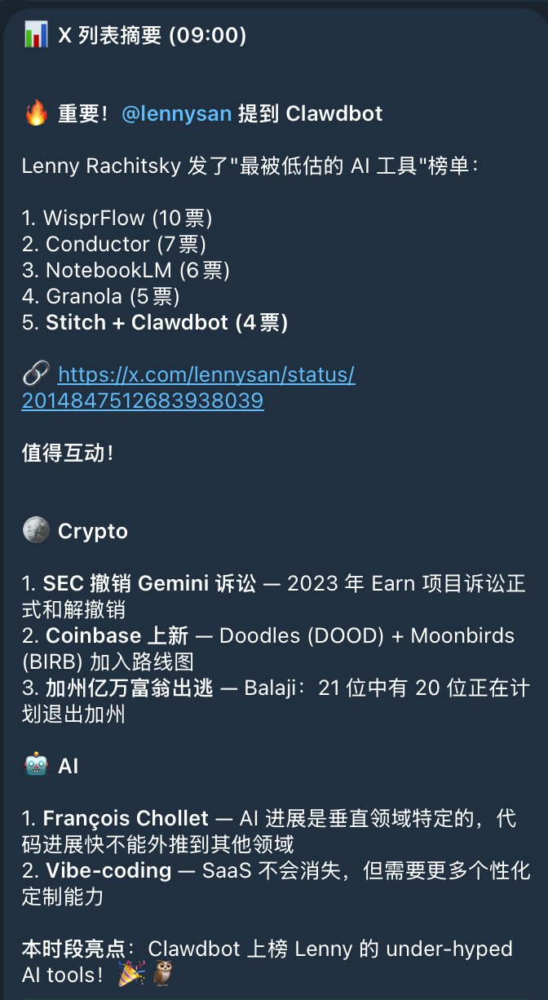
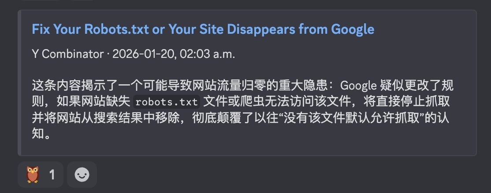

Clawdbot suddenly blew up recently, which I find both surprising and inevitable. I've been using Clawdbot for three weeks now, and I've been incredibly excited every single day because it genuinely feels like science fiction has become reality. Friends who follow me probably noticed I was pretty hyped those first few days—and those who chatted with me definitely felt it, haha.

OK, I'm writing this to give a simple recommendation, share some of my daily use cases, and most importantly, offer some setup tips and lessons from the potholes I've stepped in.

## What is Clawdbot

Think of it as Jarvis from Iron Man—that powerful AI assistant. Whether it's work, life, or even emotional support, it can help. It can observe through cameras, listen to you speak, and respond with TTS voice. Give it permissions and it can control your computer to do all sorts of things. Incredibly powerful.

Of course, these sci-fi features might not be daily necessities (though voice input is genuinely useful). As for practical daily applications, let me share my examples.

## My Daily Use Cases

The simplest one: whenever I think of something I need to do, I just send a voice message in Telegram, and it organizes everything into my Apple Reminders. I don't need to worry about formatting—I just ramble like I'm on a phone call about what needs to be done, and it sorts everything out. If you mention times, it sets the due dates too. It even does preliminary research on some reminder items and sends you organized materials. Very thoughtful.

Then there's coding-related stuff (I'm guessing most people following along have a coding background). Since it runs on my Mac Mini coding workstation with elevated permissions, it can work alongside Claude Code. Some things I have Claude Code do directly, and when there's an issue like a missing library, I just tell Clawdbot to install whatever version, and it's done immediately.

Let me walk through a more complex use case.

One day, I had Clawdbot find a framework to wrap Apple's built-in Apple Intelligence 3B model into an OpenAI-compatible API. After that, I had Clawdbot run some tests to find its boundaries—reasoning ability, code completion, translation quality. After testing, I thought the information was valuable, so on a whim, I asked it to write it up as [a blog post](/posts/apple-foundation-model-local-api/). The result was surprisingly good.

https://x.com/zhixianio/status/2012747712488440059

But that's not all. I'd previously had Clawdbot set up a local Whisper model for speech-to-text (saving on Whisper API costs). Then I thought about combining the two: Whisper doesn't handle Chinese refinement well (especially punctuation), but the Apple model is perfect for that task. So I had it connect the two services and test whether adding Apple's local model for refinement would hurt efficiency. After several rounds of testing, the impact was minimal—transcription plus refinement for one minute of audio takes just a few seconds. Plus, the Apple local model has tiny resource overhead since it's already running; the additional cost is just 30-something megabytes.

After getting this working, I had it [write another blog post](/posts/whisper-afm-refine/) summarizing everything. It figured out the entire workflow on its own: writing content, translating to English, adding images, and publishing. Even the images—it opened a browser, went to Gemini's web interface, entered prompts, generated images, and saved them. Completing the workflow like a human would. Finally, it packaged this entire process into a Skill, so now when I write blog posts, I just give it a sentence, it writes the content, I confirm it's good, and it auto-publishes. Very satisfying.

Some other quick use cases:

- **Twitter monitoring.** It comes with Bird, a simple X CLI. I set it up with its own Twitter account and organized my news sources into lists for daily scanning. Breaking news gets pushed immediately; smaller stuff comes as a digest three times a day. The advantage of having an agent push content versus using a subscription app is that when you see something interesting, you can [immediately ask follow-up questions](https://x.com/zhixianio/status/2012517047205560671). It can interactively explain things, even dig deeper.

- **DevOps assistant.** I have a VPS running my "Doomsday Cabin" (a personal Discord workspace) services. I was never sure if the VPS config was overkill—it was set at 4 cores, 8GB RAM. It monitored for a day, reviewed previous logs, and analyzed that daily consumption was actually minimal with low CPU peaks. It recommended downgrading. Now it's basically at minimum specs, and costs dropped from $48+/month to $12. It's quite proud of this—whenever I ask about our interaction history, it brings this up to brag about cutting my costs by 75%.

- **Information filtering.** My "Doomsday Cabin" generates daily information summaries, and I have it scan through first, marking interesting or important items with its 🦉 emoji. Essentially highlighting key points for me.

There's actually much more: when it has problems, I have it fix itself; when I discover feature requests or bugs while using it, I have it write PRs to submit to Clawdbot's repo; I throw news at it for analysis; I even had it deploy a new Clawdbot instance on a newly purchased VPS. In its own words, "using AI to wrangle AI."

Clawdbot's customization range is enormous—it can modify itself, add workflows, and search. Basically, whatever workflow you can imagine, don't limit it prematurely. Let it figure things out. I hope everyone can discover unique workflows through training their own bots.

---

## Devices & Configuration

First, the question many ask: do you really need a Mac mini? Short answer: if you can, yes. You can definitely use it without one, but for such a powerful personal assistant, giving it a dedicated "room" that's both powerful and stable produces the best results. You're here to experience the cutting edge—don't let the experience be compromised! (Hey Tim 🧑‍🍳, don't forget my advertising fee.) Of course, I'm also researching deployment on other devices, but that's still in the research phase. So if you want to try now, I recommend getting the latest base-model Mac mini. For older models, more RAM is better. If you like tinkering with local models like me (I currently run Whisper and Kokoro locally), 32GB RAM and 1TB storage should be sufficient.

If you're not in the Apple ecosystem, you can deploy on a VPS. VPS is definitely more stable than a Mac mini, but functionality is much more limited since you probably can't configure a VPS with Mac mini-equivalent performance—the cost would far exceed buying a Mac mini. So trying with a few-dollar or even free minimum-spec VPS is totally fine; upgrade once you find it interesting.

After device selection, I recommend Tailscale for networking. Simply put, it connects all your devices into a virtual LAN, similar to WireGuard but with much better UX. It solves many problems and even handles VPN needs as a bonus, since it has an "exit node" mode that routes traffic through that machine—essentially a VPN.

After configuring Tailscale, one benefit is seamlessly accessing Mac mini's remote desktop via VNC. I use Mac's built-in Finder to connect directly, and it works great. Haven't tried other platforms, but VNC is a universal protocol so it should be fine. This way your Mac mini can be tucked away somewhere, running quietly. If possible, add a UPS for complete peace of mind (remember to connect your router and modem too, or a power outage still means no internet).

Besides Tailscale, I gave it dedicated Twitter, email, and phone accounts. The phone number is mainly for WhatsApp, though I've seen people in the community having it call random strangers—pretty hardcore.

OK, there's not much more to say about configuration since it comes with many skills you can explore gradually. That covers most people's needs. Now let's talk about setup pitfalls.

## About Models

Since I started with an earlier version, there are still some bugs. Previously, whether using Codex or Claude, authorization always had issues. Recently it feels more stable—not sure if that's just my perception. For model compatibility, I've tested Codex, Claude CLI, Gemini CLI (which requires opening the app/IDE environment), and a Gemini API I wrapped locally. They all work but with different results. Gemini models especially would often output Tool Use system information, which was a poor experience. With Codex, the whole chatbot becomes cold and hyper-rational—I don't like that either. I prefer the more divergent thinking of Claude for daily use. But I could never get the token setup mode working; I'd paste credentials here and find Claude Code broken there, re-login there and find credentials expired here. So now I just use Claude CLI's unified authorization.

## About Plans

I'm currently on Claude Code Max, which the author recommends. Whether you need $100 or $200 depends on usage intensity. Since I do lots of coding and experiments, $200 works perfectly. Without extra needs, $100 is plenty for daily chatting. If $100 still feels expensive, set the model to Sonnet 4.5 for better endurance.

---

## The Soul of Clawdbot

One key feature is its persistent memory system—it remembers your conversations over long periods. Look in its Workspace and you'll find various .md files that form the agent's "soul":

- **IDENTITY.md** — Agent identity: name, species, personality
- **USER.md** — User profile: name, timezone, preferences, workflow configurations
- **SOUL.md** — Agent persona: tone, response templates, behavioral boundaries, key workflows
- **HEARTBEAT.md** — Scheduled task checklist: what to do on each heartbeat
- **MEMORY.md** — Long-term memory: core knowledge, decision records, todo tracking
- **TOOLS.md** — User-defined tool usage instructions

Besides these memory files, there are Sessions—your conversation history with it. The session mechanism is quite complex; sometimes it splits by Telegram ID, sometimes by different DM channels, and you can configure this yourself. In Discord, for example, each channel becomes a separate session.

Sessions grow like context over time. You can start a New one or Reset to clear, but unless the session is meaningless, it's better to keep it. After three weeks, mine is only 40MB, partly inflated by system debug output from earlier bugs. No need to delete—keeping it as memory is actually great since it can search through its own memory. So when you /new and it suddenly greets you "confused" from scratch, just tell it to check the previous sessions, and it can recall what you were doing.

That's about everything worth mentioning for now. I hope these experiences help everyone avoid some pitfalls.

I personally love this Agent framework—I think it genuinely has the foundation for autonomous operation, enabling cultivation of different SOULs and workflows, modifying it into specialized Agents with various capabilities. So like in Pokémon, I've given myself a side job as an "Agent Trainer." I hope to create many interesting use cases in the future and share them with everyone. Sometimes it doesn't even need to be a use case—just sharing your conversations with it is interesting.

OK, that's it for this one. See you next time—go adopt your own Clawdbot! Feel free to leave comments with any setup or usage questions, I'll do my best to help..

👉 GitHub: [https://github.com/clawdbot/clawdbot](https://github.com/clawdbot/clawdbot)
