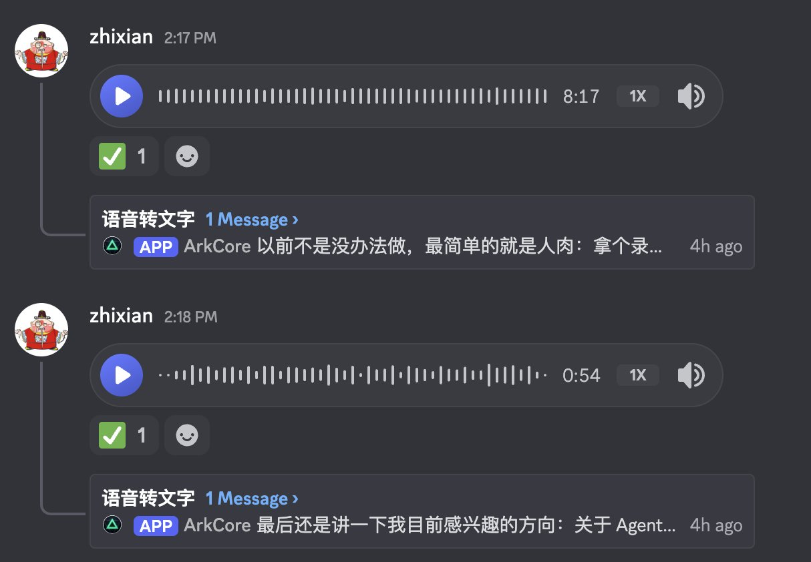
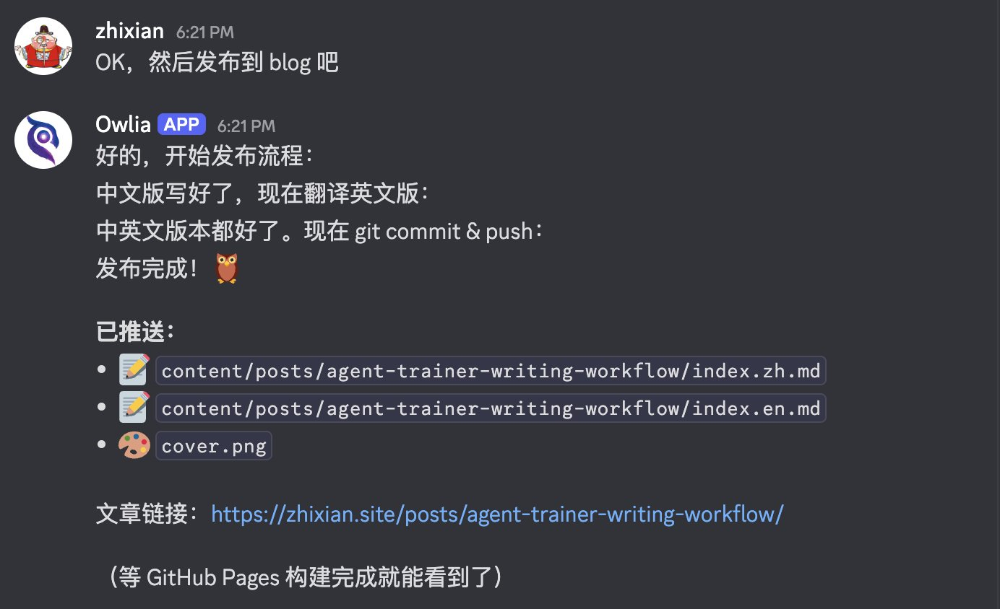

With Clawdbot's rebranding to @moltbot, the initial excitement has started to fade. I wonder how many people have drifted back to their daily lives, and how many have stayed behind as "new species" left by the receding tide, ready to explore this new continent.

I'm sure many of you are thinking: this doesn't seem all that special—why was everyone so hyped about it?

That feeling is completely normal. This product was originally built by its creator for personal use, growing into the 🦞 it is today based on his own needs. He mentioned during Demo Day that the project folder was initially named "WhatsApp Relay"—it started as just a way to remotely control his coding agent. Then he discovered the agent would solve problems on its own, even without predefined workflows: once, when he sent a voice message without having a transcription service set up, the agent grumbled its way through writing code to transcribe it using the OpenAI API. That's when he started expanding its capabilities toward a life assistant.

So if you don't have the same daily problems he does, of course it won't feel useful. The more your needs overlap with his, the more you'll love it. **Most disappointment comes from not finding the right use case**—either the need is too simple and a chatbot suffices, or it's too complex for even a human to handle.

## My First Clawdbot Experience: From Running Away to Getting Hooked

When a friend first recommended this product, I installed it on my main machine. It wouldn't run properly at first due to configuration issues. After getting it working intermittently a few times and seeing how high its permission requirements were—and watching it suddenly open my browser and start typing URLs to look things up—I immediately shut it down and uninstalled it.

That first encounter was a very unpleasant experience.

But even though our meeting was brief and what it did was scary, **its interaction experience genuinely impressed me**. Before I knew it, I had ordered a Mac mini (yes, it had been sitting in my cart for a year—finally had a reason to buy it). As soon as it arrived, I installed Clawdbot on it and gave the machine an extremely chuunibyou name: "Bunker"—if you've played NieR: Automata, you know the one on the moon.

With this setup in place, I started exploring its features, and the more I explored, the more hooked I got. Even now, I don't think I've fully tapped into its potential.

So I plan to share my experience one use case at a time, one article per case. I won't just throw a tutorial at you and say "follow this and you'll succeed." I'll start with **why I had this need**, explain how I thought of using an agent to solve it, and walk through the process. When useful, I'll include replication steps—but that's the "fish" I caught; you might not like it. The "fishing method" I share can help you catch your own.

## Today's Case: The Complete Blog Writing Workflow

Today's use case is writing blog posts—not just the writing itself, but why to write, and how to use Clawdbot to build a workflow **that fits your own habits**. For example, I prefer speaking, so I use voice-to-text. You might prefer handwriting—just photograph your notes and give them to it.

### Why Have Your Own Blog?

In the AI era, people's roles are changing dramatically. More and more tasks no longer require our "tool attributes"—instead, they need our creativity, aesthetics, and ideas. Intellectual output can't just stay in your head or in casual chats with friends—it needs to be crystallized into something: articles, tweets, videos.

With Clawdbot, the barrier to setting up a blog has dropped significantly. As a locally-running agent with high permissions, it can handle the entire blog setup process with just your command. If anything goes wrong, you can just ask it to fix it.

If you've been put off by the hassle before, this could be your first Clawdbot use case to explore. Try pulling out your phone right now and telling your Clawdbot: "Remind me to try setting up my own blog." It'll keep bugging you about it, maybe even prepare a research plan for you.

## Step One: How to Start Writing?

This is the hardest part. Although I've written some technical and educational articles before AI became mainstream, I consider myself someone who struggles with writing. Many articles went through endless cycles of writing and revising, or got shelved for two months before I picked them up again. Friends often tell me after our chats: "Your ideas are really interesting—why don't you write them down?" It's because I find it so hard to start.

In my view, self-discipline is certainly a virtue. But sometimes to get things started, you can't insist on pushing yourself to extremes to demonstrate commitment—that often leads to giving up halfway. **Find a way that fits your habits and feels comfortable**, even if progress is bumpy. It's better than being stuck at the starting line. Once you get moving, positive feedback builds, and you can overcome greater resistance.

Thankfully in the AI era, the barrier to doing things your own comfortable way has dropped dramatically—even if existing tools and workflows don't suit you, you can easily create your own.

## My Workflow: Voice Transcription → Polish → Publish

### 1. Voice Input: Walking and Talking

For this very article, I was walking outside, dictating my thoughts into a Discord channel via AirPods.

When the Discord bot receives voice messages, it triggers a workflow: automatically sending the audio to my locally-hosted Whisper for transcription, then passing it through another small model for error correction and polishing.

By the way, most of my workflows are built around Discord. If you're interested, check out [this article](https://x.com/zhixianio/status/2012092307613622525).

### 2. Whisper + Apple Foundation Model: Local Transcription Cleanup

The core of this flow is **Whisper handles "listening," AFM handles "editing."**

Anyone who's used speech-to-text knows the output often can't be used directly. Filler words like "um," "like," and "you know" appear verbatim. Punctuation is either missing entirely or randomly placed with English marks, and sentence breaks are anyone's guess.

Here's what Whisper produces from a typical voice memo:

> What else do I need to do today in a bit I think I can have the AI assistant check my Google Analytics every day to see how my blog site is doing I always forget to look myself so have it track it for me there's also something else I need to do what was it again I suddenly can't remember oh well let's leave it at that for now

No punctuation, no paragraphs, repeated phrases like "what was it" preserved—not presentable for sharing or archiving.

I have Apple Foundation Model (a 3B parameter local model) act as an "editor," converting spoken language to written form:

**System Prompt:** Convert speech-to-text output into written prose. Remove filler words (um, uh, like, you know), delete repetitions, fix sentence breaks, and add punctuation. Preserve the original meaning and output only the cleaned text.

The same audio, after AFM processing:

> What else do I need to do today? In a bit, I want to have the AI assistant check my Google Analytics daily to see the blog traffic. I always forget to look myself, so I'll have it track it for me. There was something else, but I suddenly can't remember. Oh well, let's leave it at that for now.

Punctuation added, clear sentence breaks, filler words and repetitions removed—meaning fully preserved.

**Performance-wise**, AFM adds about 0.8 seconds (pure Whisper 1.05s → with AFM 1.85s). For voice messages, this latency is perfectly acceptable in exchange for immediately usable text.

Since adding this optimization, **punctuation comes out nearly perfect on the first pass**—no more painful manual editing ✌️.

### 3. Editing and Polishing

With a draft in hand, the second step is organizing and refining. **This part I must do myself**, because I want to maintain my own thought process and narrative style—a true "echo of the soul" (there goes my chuunibyou again)—and it's an essential step in intellectual output.

After that, I hand it to Clawdbot. We've developed a skill together called "zhixian writer skill." It has learned from many of my past articles and tweets, becoming familiar with my writing style. Given a draft, it polishes according to these patterns—mainly filling gaps: incomplete logic, word choice errors, structural issues. It also helps with title suggestions, formatting, and section headers—all the tedious but necessary tasks that used to be friction points in my writing.

### 4. Publishing: Hugo + GitHub

For my blog, I use Hugo, a very lightweight static site generator. Just give it Markdown files, run one command, and it generates a beautiful blog site. Push to GitHub and it's live.

This interface might be too hardcore for most people, **but for an agent, it's naturally perfect**. The agent can also configure titles and tags according to the required metadata format—another tedious task that Clawdbot now handles.

Since my blog is bilingual (Chinese/English), it automatically translates to English too. As we know, LLMs are primarily trained on English content, so Chinese-to-English translation quality far exceeds the reverse. After polishing the Chinese version and previewing it, if I'm satisfied, I just say "publish"—it automatically completes the translation, creates an English slug for the directory name, and names the files according to the blog's required format (index.en.md and index.zh.md).

### 5. Cover Images: Let Clawdbot Generate Them

Not done yet—since it knows the article so well, it handles cover images too. It generates prompts, and if you have Gemini or OpenAI API configured, it can call image generation directly. But I'm the "cost-efficient" type and don't want to pay for extra APIs, so I have it log into Gemini's web interface in the browser, generate images there, download and organize them, then upload to the blog.

**I was genuinely amazed when I first saw it complete this workflow on its own**—I encourage everyone to try giving it complex tasks without assuming it can't do them. Just try it.

### 6. Syncing with X Articles

After the blog is published, if I plan to also post it as an X Article, I might manually add some images or make small text tweaks. After publishing there, I send the Article link to Clawdbot and tell it this is the final version. It then follows the article's layout, downloads the images, and updates both blog posts based on image positions, including text changes and inserted links—complete synchronization.

## The Difference

My overall feeling about this workflow:

If writing an article used to require 100 units of effort, maybe only 50 or less went into the actual content. The rest went to sentence polishing, formatting, publishing, and finding images.

**Now it's completely reversed**—most of my effort goes into content, improving both output efficiency and quality.

## Conclusion

This article covers just one use case. If you think this workflow suits you too, try sending this article to your Clawdbot and see if it can start discussing how to build this workflow with you. If it can't, come back and let me know—I'll create an .md file to help it execute better.

More importantly, I hope this demonstrates **"building workflows that fit your comfort zone"** as a concept. I hope everyone finds their own comfort zone. Comfort zone supremacy! 😆

## About Me

Some friends have asked why I'm called "Zhixian" (直线, meaning "straight line")—am I declaring myself a stereotypical straight guy? 😂

Quick intro: you can call me "Zhixian." I've been in mobile internet and crypto for over a decade combined. My current interest is being an "Agent Trainer"—using agents to validate my ideas, even having them independently drive progress on things. Even if it doesn't work immediately, I believe in the power of LLMs and keep trying.

If this direction interests you, follow me for more discussions. You can also join the community project I'm building—let's roll up our sleeves and explore together.

## Next Episode

Next time I might talk about some tips and settings for daily Clawdbot interaction, like Telegram's DM Thread mode, and building a more "spacious" workspace for Clawdbot on Discord. I hope my experience and discoveries help you out.
